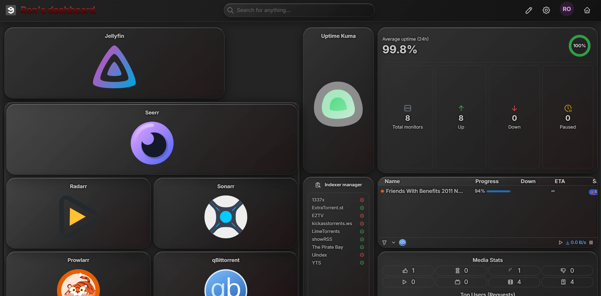

# homelab

Everything on the home server that is not the streaming system. The streaming stack
(Jellyfin, *arr, qBittorrent, ...) lives in its own repo, `streameron`, and the two repos do not
depend on each other.

Currently in the testing stage: a desktop PC (Windows + Docker Desktop) simulates the server
before everything moves to a dedicated Linux machine. What is planned for each stage is in
[docs/ROADMAP.md](docs/ROADMAP.md).

## Screenshots

### Dashboard (Homarr)



<!-- Add more as the project grows, one heading per system:
### Monitoring (Uptime Kuma)

-->

## Layout

One folder per stack under `stacks/`. Each stack is self-contained:

```
stacks/<name>/
  compose.yaml    # the services
  .env.example    # template for secrets/settings -> copy to .env
  appdata/        # the apps' data (git-ignored, created on first run)
```

Outside `stacks/`: `docs/ROADMAP.md` (what is planned) and `docs/images/` (screenshots).

Run a stack from inside its folder:

```bash
cd stacks/<name>
docker compose up -d
```

## Stacks

| Stack | Services | Address | Status |
|---|---|---|---|
| `dashboard` | Homarr + its Tailscale machine | http://localhost:7575, https://dashboard.<tailnet>.ts.net | in use |
| `monitoring` | Uptime Kuma, WUD (+ socket-proxy) | http://localhost:3001, http://localhost:3000 | in use |
| `tools` | IT-Tools | http://localhost:8081 | in use |

Everything not installed yet is listed in [docs/ROADMAP.md](docs/ROADMAP.md), by stage.

## Conventions

- **No shared Docker networks between stacks or with streameron.** A service that needs another
  stack's service reaches it through the host's published port:
  `http://host.docker.internal:<port>`.
- **Remote access** is through the Tailscale app on the host (`http://<host>:<port>`). A
  per-service Tailscale container is the exception, for a service that deserves its own
  easy-to-find name (the dashboard) or is shared with other people.
- **Secrets** go in each stack's `.env`, never in git.
- **One container per tool, grouped into stacks by purpose.** Tools are never merged into one
  container; a stack (one `compose.yaml`) is the unit that is started, stopped and moved.
- **Docker socket.** Access to it is effectively control of the host, so no app container mounts
  it. A tool that only needs to *read* Docker state goes through `socket-proxy` (in the
  `monitoring` stack), which exposes a filtered read-only API. A tool that must *manage*
  containers (Dockge, later) is a deliberate, documented exception.

## dashboard (Homarr)

### First run

1. `cd stacks/dashboard`, copy `.env.example` to `.env`, fill `SECRET_ENCRYPTION_KEY`.
2. `docker compose up -d`, open http://localhost:7575 and complete onboarding.
3. Add the streameron integrations. For each one:
   - **Integration URL** (used by Homarr itself): `http://host.docker.internal:<port>`
   - **App URL** (what the browser opens): the host's LAN IP or Tailscale name

   The two are not interchangeable: the host's name resolves in the browser but not inside the
   Homarr container (`ENOTFOUND`), and `host.docker.internal` means nothing to the browser.

| Service | Port |
|---|---|
| Jellyfin | 8096 |
| Seerr | 5055 |
| Sonarr | 8989 |
| Radarr | 7878 |
| Bazarr | 6767 |
| Prowlarr | 9696 |
| qBittorrent | 8080 |

### Backup / moving hosts

Stop the stack, copy `stacks/dashboard/appdata/` and the `.env` to the new host. The same
`SECRET_ENCRYPTION_KEY` must come along, otherwise the saved integration keys cannot be read.

`appdata/tailscale/` is the `dashboard` machine's identity (private key, treat as a secret).
Copied along, the machine keeps its name. Never run the same state on two hosts at once.

## monitoring (Uptime Kuma)

Uptime Kuma itself needs no settings (the stack's `.env` is for WUD, below).
`cd stacks/monitoring`, `docker compose up -d`, open http://localhost:3001
and create the admin user (choose the embedded SQLite database if asked).

Add one **HTTP(s)** monitor per service. A plain page check is enough for most; for the *arr
apps the `/ping` endpoint answers without login.

| Service | Monitor URL |
|---|---|
| Jellyfin | `http://host.docker.internal:8096/health` |
| Seerr | `http://host.docker.internal:5055/api/v1/status` |
| Sonarr | `http://host.docker.internal:8989/ping` |
| Radarr | `http://host.docker.internal:7878/ping` |
| Prowlarr | `http://host.docker.internal:9696/ping` |
| Bazarr | `http://host.docker.internal:6767` |
| qBittorrent | `http://host.docker.internal:8080` |
| Homarr | `http://host.docker.internal:7575` |

### Showing it in Homarr

Homarr's Uptime Kuma integration reads a **status page**, not the monitors directly. In Uptime
Kuma: Status Pages -> New Status Page, slug `default`, add a group with the monitors, save. Then
in Homarr add the integration with URL `http://host.docker.internal:3001` and "No secrets".
Note that a status page is readable without login by anyone who can reach port 3001.

Known limit: Uptime Kuma runs on the same machine it watches, so it reports a single service
going down, not the whole host going down.

## monitoring (WUD)

WUD (What's Up Docker) lists every running container and whether a newer image exists for it.
It refuses to start without an administrator: copy `stacks/monitoring/.env.example` to `.env`,
set `WUD_AUTH_ADMIN_USER` and `WUD_AUTH_ADMIN_PASSWORD`, then `docker compose up -d`, open
http://localhost:3000 and log in with them. The user is kept in `appdata/wud/`.

It only watches: no triggers are configured, so it never pulls or restarts anything. Updating
stays manual:

```bash
cd <the stack's folder>
docker compose pull
docker compose up -d
```

It reads Docker through `socket-proxy` (same compose file), which allows listing containers and
images and refuses every write. `socket-proxy` has no published port; only this stack reaches it.

Containers on a floating tag such as `latest` are compared by image digest, so the update shows
as `sha256:...` and only means a new build was published; containers pinned to a version tag
(for example `recyclarr:8`) are compared by version number.

Both commands need Docker Desktop running; "cannot find the file specified" on the
`dockerDesktopLinuxEngine` pipe means it is not.

## tools (IT-Tools)

`cd stacks/tools`, `docker compose up -d`, open http://localhost:8081. Static web app, no data.
